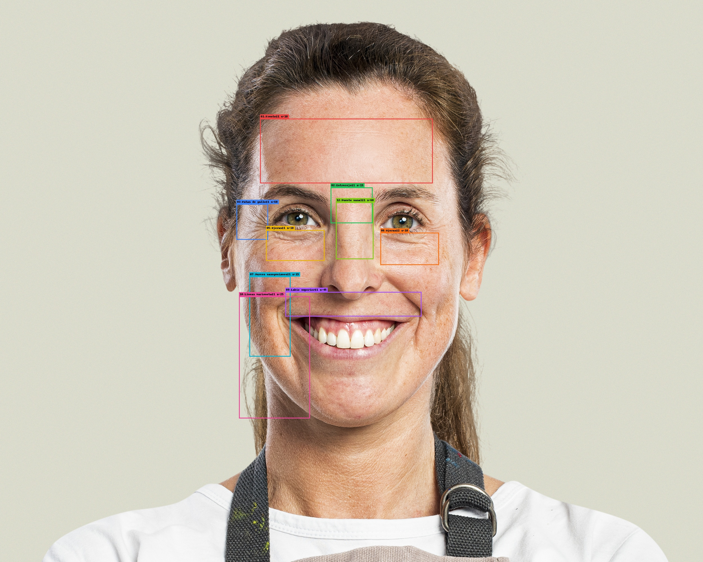
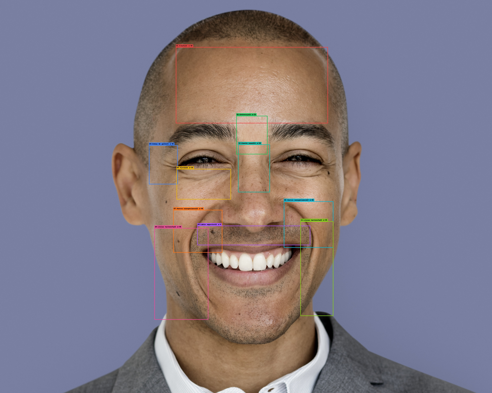

# Guia De Etiquetado Facial para Deep Learning

Gracias por ayudarnos a construir un dataset de **imágenes etiquetadas** para entrenar un modelo de Deep Learning enfocado en **envejecimiento facial**.

Tu tarea es muy sencilla: vas a abrir el anotador, dibujar unas cajas sobre partes clave del rostro y guardar los cambios.  
Cada vez que guardas, la herramienta genera automáticamente un archivo con la información de la anotación y lo envía al repositorio del proyecto para que podamos usarlo en el entrenamiento.

No necesitas conocimientos técnicos: solo precisión y consistencia al marcar las cajas ✅


## Así se ve una anotación 

<div align="center">

| Ejemplo de anotación 1 | Ejemplo de anotación 2 |
|---|---|
|  |  |

</div>


## Inicio En 2 Minutos ⚡

1. Abre terminal en esta carpeta.
2. Instala dependencias:

```bash
pip install -r requirements.txt
```

3. Abre `annotate_jupyter.ipynb` y ejecuta las celdas.

## Opcion Recomendada: Jupyter

Nosotros te proporcionamos un Jupyter Notebook listo para ejecutar: `annotate_jupyter.ipynb`. 

Pero si quieres crear uno nuevo deberas usa estos chunks:

### Chunk 1: Cargar modulos

```python
import importlib
import sys
from pathlib import Path

SRC_DIR = Path("src").resolve()
if str(SRC_DIR) not in sys.path:
    sys.path.insert(0, str(SRC_DIR))

import envegecimiento.external_bbox_annotator as external_bbox_annotator
import envegecimiento.run_annotation as run_annotation

importlib.reload(external_bbox_annotator)
importlib.reload(run_annotation)
```

### Chunk 2: Ejecutar etiquetado

```python
NUM_IMAGES = 2  # cambia este numero

result = run_annotation.run(
    "data",          # carpeta con imagenes o ruta de una imagen
    num_images=NUM_IMAGES,
)
result
```

### Chunk 3 (opcional): Ver preview de un JSON

```python
from envegecimiento.preview_boxes_from_json import show_boxes_from_json

preview = show_boxes_from_json("results/tu_archivo_annotations.json")
preview
```

## Opcion 2: Script En IDE

Archivo: `annotate_ide.py`

1. Cambia `IMAGE_PATH`.
2. Cambia `NUM_IMAGES`.
3. Ejecuta:

```bash
python annotate_ide.py
```

## Opcion 3: Consola (CLI)

```bash
python annotate_cli.py data --count 2
```

Para una imagen especifica:

```bash
python annotate_cli.py "data/mi_imagen.jpg"
```

## Que Se Guarda

- JSON local en `results/`
- JSON remoto en Drive (nombre = nombre de imagen)
- Preview en `data_boxes/`

## Si Algo Falla

1. Ejecuta de nuevo `pip install -r requirements.txt`.
2. Verifica que estas en la carpeta raiz del proyecto.
